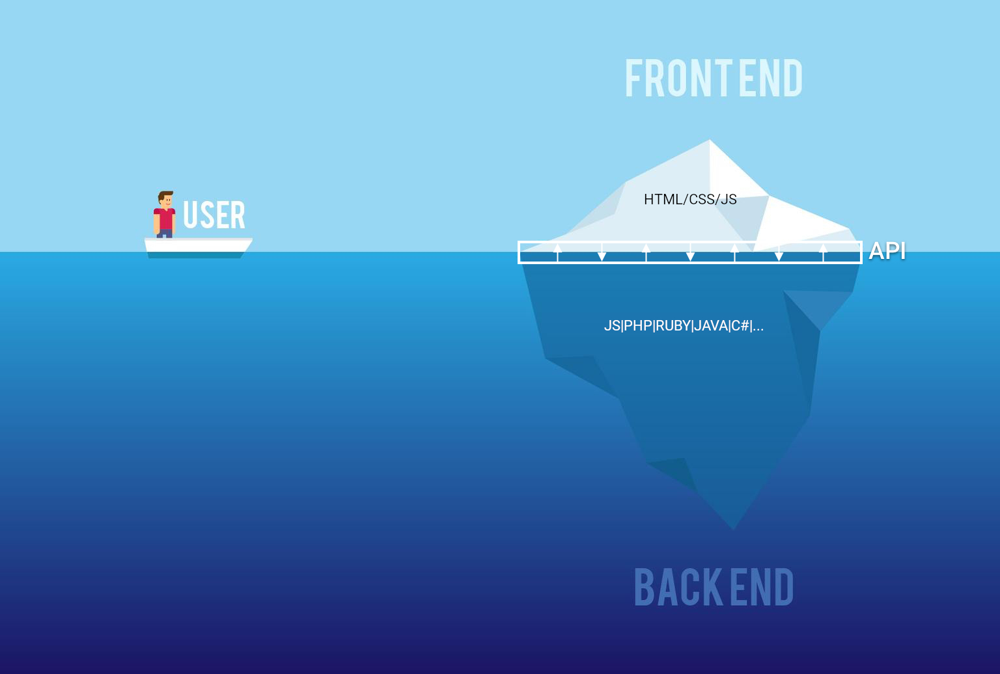

# Node.js & Express

Quand JavaScript sort du navigateur

---

# JavaScript avant Node.js

* JavaScript s’exécutait **uniquement dans le navigateur**
* Impossible de :

  * accéder au système de fichiers
  * ouvrir des sockets
  * créer des serveurs HTTP

➡️ JS = langage frontend uniquement

---

# Naissance de Node.js

* Créé en **2009** par **Ryan Dahl**
* Basé sur le moteur **V8** de Google Chrome
* Objectif :
  * créer des serveurs **rapides**
  * **non bloquants**
  * capables de gérer beaucoup de connexions

---

# L’idée clé de Node.js

➡️ Utiliser **JavaScript partout**

* Frontend : navigateur
* Backend : Node.js
* Même langage
* Même concepts (callbacks, promesses, async/await)

---

# Le modèle non bloquant

Node.js repose sur :

* une **event loop**
* un **thread principal unique**
* des opérations I/O asynchrones

➡️ Très performant pour :

* API
* temps réel
* micro-services

---

# Node.js n’est PAS

* Multi-thread classique
* Fait pour le calcul intensif

➡️ Pour le CPU lourd :

* workers
* services séparés

---

# Exemple simple Node.js

```js {monaco} {height:'auto'}
// hello.js
console.log("Hello from Node.js")
```

```bash
node hello.js
```

➡️ JavaScript **hors navigateur**

---

# Pourquoi Node.js a gagné

(Premier sur [Stackoverflow Survey 2025](https://survey.stackoverflow.co/2025/technology#1-web-frameworks-and-technologies))

* énorme écosystème (**npm**)
* JavaScript partout
* faible barrière d’entrée
* parfait pour les API modernes

---

# Concurrents de Node.js

* [**Deno**](https://deno.com/)
  * créé par Ryan Dahl
  * sécurisé par défaut
  * TypeScript natif
  * tools intégrés
* [**Bun**](https://bun.sh/)
  * très rapide
  * runtime + bundler + test runner
* ...

---
layout: question
---

Mais c'est quoi une application web ?

---

# Une application web 

 * Ca répond à des requêtes HTTP
 * C'est accessible via internet (pas toujours ➡️ intranet)
 * C'est utilisable avec un navigateur (pas toujours ➡️ API)

---
 


[source](www.designquote.net)


---

# Une requête HTTP

```
GET /gp/cart/view.html?ref_=nav_cart
Host: www.amazon.fr
Accept: text/html
User-Agent: Chrome/27.0.1453.110
```

# La réponse

```
HTTP/2 200 
content-type: text/html; charset=UTF-8
Content-Length: 155
date: Wed, 26 Aug 2020 13:59:36 GMT

<html>...</html>
```

---


# Les verbes HTTP

| Verbe     | Définition                    |
| --------- | ----------------------------- |
| GET       | Lecture d'une ressource       |
| POST      | Création d'une ressources     |
| PUT       | Mise à jour d'une ressource   |
| DELETE    | Suppression d'une ressource   |

---

# Les headers HTTP

| Headers       | Définition                    |
| ------------- | ----------------------------- |
| Accept        | Format des données attendues  |
| Content-Type  | Format des données envoyées   |
| Cache-Control | Politique de cache            |
| Authorization | Token d'authentification      |
| Origin        | L'origine de la consultation  |

---
layout: two-cols-header
---

# Les codes de retour

::left::

| Headers       | Définition                    |
| ------------- | ----------------------------- |
| 1xx           | Informational                 |
| 2xx           | Success                       |
| 200           | <v-click>Ok</v-click>         |
| 201           | <v-click>Created</v-click>    |
| 3xx           | Redirection                   |


::right::

| Headers       | Définition                               |
| ------------- | ---------------------------------------- |
| 4xx           | Client errors                            |
| 400           | <v-click>Bad Request</v-click>           |
| 401           | <v-click>Unauthorized</v-click>          |
| 403           | <v-click>Forbidden</v-click>             |
| 404           | <v-click>Not found</v-click>             |
| 5xx           | Server errors                            |
| 500           | <v-click>Internal Server Error</v-click> |

---

# La norme REST

 * REpresentational State Transfer
 * Créer par Roy Fielding en 2000
 * Se base sur les url, les verbes et les headers
 * Permet de faire une API facilement utilisable
 * Simple à comprendre

---
layout: question
---

Pourtant ça à l'air compliqué...

---

# Récupérer toutes les pizzas

<v-click>
```
GET /pizzas
Host: www.pizzima.fr
Accept: application/json
```

```json
// Status code 200
[
    {id: 1, name: "Classique jambon" },
    {id: 2, name: "Bellachô" },
    {id: 3, name: "Super veggie" },
    ...
]
```
</v-click>

---

# Récupérer la pizza n°42

<v-click>
```
GET /pizzas/42
Host: www.pizzima.fr
Accept: application/json
```

```json
// Status code 200
{
    id: 42, 
    name: "4 Fromages",
}
```
</v-click>

---

# Ajouter une pizza

<v-click>
```
POST /pizzas
Host: www.pizzima.fr
Accept: application/json

{
    name: "Pepperoni",
    description: "Une pizza au pepperoni"
}
```

```json
// Status code 201
{
    id: 50,
    name: "Pepperoni",
    description: "Une pizza au pepperoni"
}
```
</v-click>

---

# Modifier la pizza n°42

<v-click>
```
PUT /pizzas/42
Host: www.pizzima.fr
Accept: application/json

{
    name: "5 Fromages",
    description: "Une pizza au fromage"
}
```

```json
// Status code 200
{
    id: 42,
    name: "5 Fromages",
    description: "Une pizza au fromage"
}
```
</v-click>

---

# Supprimer la pizza n°42

<v-click>
```
DELETE /pizzas/42
Host: www.pizzima.fr
Accept: application/json
```

```json
// Status code 200
{
    id: 42,
    name: "5 Fromages",
    description: "Une pizza au fromage"
}
```
</v-click>

---

# Récupérer les ingrédients de la pizza n°42

<v-click>
```
GET /pizzas/42/ingredients
Host: www.pizzima.fr
Accept: application/json
```

```json
// Status code 200
["Sauce tomate", "Mozzarella", "Jambon"]
```
</v-click>

---
layout: question
---

Ok, mais en Javascript, on fait ça comment ?

---

# Qu’est-ce qu’Express.js ?

* Framework web minimaliste pour Node.js
* Créé en **2010**
* Basé sur :
  * le module `http` de Node
  * une couche d’abstraction simple

➡️ Facilite la création d’API HTTP

---

# Pourquoi Express ?

Sans Express :

```js
import http from "http"

const server = http.createServer((req, res) => {
  res.writeHead(200)
  res.end("Hello")
})

server.listen(3000)
```

➡️ Verbose et peu flexible

---

# Avec Express

```js
import express from "express"

const app = express()

app.get("/", (req, res) => {
  res.send("Hello Express")
})

app.listen(3000)
```

✔ Lisible
✔ Expressif
✔ Maintenable

---

# Les routes

```js
app.get("/users", (req, res) => {
  res.json([{ id: 1, name: "Alice" }])
})

app.post("/users", (req, res) => {
  res.send("User created")
})
```

* GET
* POST
* PUT
* DELETE

---

# Les paramètres

```js
app.get("/users/:id", (req, res) => {
  res.send(`User ${req.params.id}`)
})
```

---

# Le body

```js
app.use(express.json())

app.post("/login", (req, res) => {
  const { email, password } = req.body
  res.send("ok")
})
```

---

# Les middlewares

Un middleware est une fonction qui :

* reçoit `req`, `res`, `next`
* peut modifier la requête
* peut bloquer ou continuer

```js
app.use((req, res, next) => {
  console.log(req.method)
  next()
})
```

---

# Concurrents d’Express.js

* **Fastify**
  * plus rapide
  * typage TS avancé
* **NestJS**
  * inspiré d’Angular
  * très structuré
  * basé sur Express ou Fastify
* ...

---

# Express aujourd’hui

* Toujours très utilisé
* Stable
* Énorme écosystème

