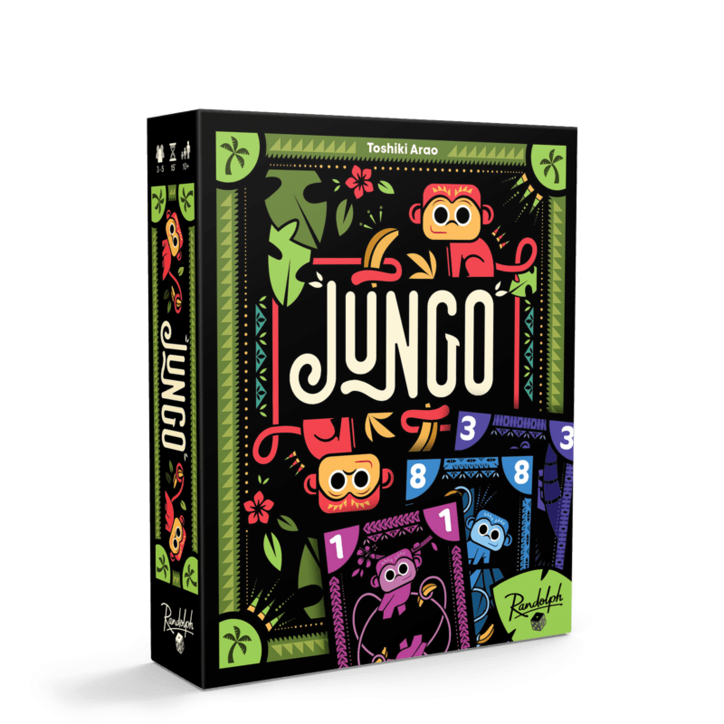

# Introduction

---

# Présentation du cours

- Séance 1 à 5 => ~1h de cours, ~1h de TP indépendant
- Séance 6 à 10 => ~1h de cours, ~1h de TP fil rouge
- ⚠️ **Prenez des notes !**

---

# TP fil rouge

Création d'une application web

---

# Thèmes abordés

- Javascript
- Typescript
- Node.js
- Express
- React

A rajouter dans votre CV 😉

---

# Notation

Partiel de 2h

**Sans documents**

---

# Liens utiles

- [javascript.usson.dev](https://javascript.usson.dev)
- [julien@usson.dev](mailto:julien@usson.dev)

---

# Qui suis-je ?

Julien Usson

Ancien ZZF5 promo 17

Développeur Web à [Easymov Robotics](https://www.easymov.fr/)

---

# Et vous ?

- Prénom
- Déjà fait du web ? Si oui, quoi ?
- Connais Javascript ? Déjà fait ?
- Quel métier visé après l'ISIMA ?
