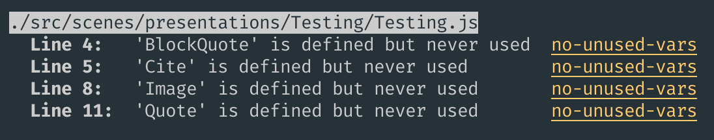

# Les tests
Tester, c'est douter

---

# Static analysis / Linting

 * Analyse du code sans l'exécuter
 * Détecte les erreurs de programmation comme :
    * Les variables non utilisées
    * Les imports manquants
    * ...
 * Intégré aux IDEs pour un feedback immédiat
 * [Eslint](https://eslint.org/) ➡️ le plus utilisé en Javascript

---



---

# Unit testing

 * Test d'une portion ou unité d'une application
 * On va tester les fonctions de manière isolées
 * Ecrire des fonctions pures ➡️ plus simple à tester

---

```javascript {monaco} {height:'auto'}
function add(a, b) {
    return a + b
}

describe("add", () => {
    test("should add two numbers", () => {
        expect(add(1, 1)).toEqual(2)
    })

    test("should add two negatives numbers", () => {
        expect(add(-1, -1)).toEqual(-2)
    })
})
```

---

# Integration testing

 * Test d'une fonctionnalité
 * Dans une app web ➡️ test d'une route
 * On va tester l'intéraction entre plusieurs fonctions

---

```javascript
describe("find all cars", () => {
    test("should respond with a 200", async () => {
        const response = await request(app).get("/cars")
        expect(response.statusCode).toBe(200)
        expect(response.body).toEqual([{...}, {...}])
    })
})
```

---

# Test d'integration vs test unitaire


---

# Test d'integration vs test unitaire


---

# Test runners / frameworks

Outils pour écrire et exécuter les tests

- Jest
- Vitest
- Mocha + Chai
- ...

➡️ Ils fournissent :
- une syntaxe de test (`describe`, `it`, `test`)
- un moteur d’exécution
- un système d’assertions (ou s’y intègrent)

---


# End-to-End testing

Pour tester l'application comme un utilisateur
- Cypress
- Playwright
- Puppeteer
- ...

➡️ Tests :
- clics
- formulaires
- navigation
- comportements UI

---

# Et pleins d'autres encore 

 * Mutation testing
 * Contract testing
 * Monkey testing
 * Canary testing
 * ...
